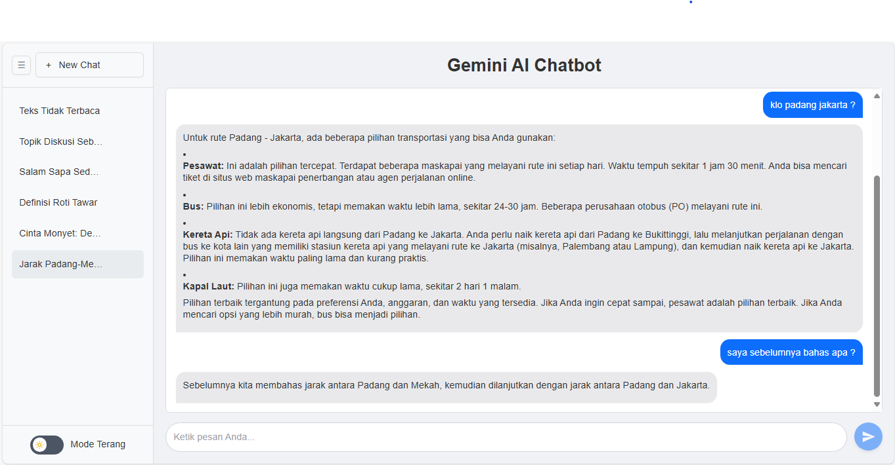

# Gemini AI Chatbot



Gemini AI Chatbot adalah antarmuka percakapan berbasis web yang memungkinkan pengguna untuk berinteraksi dengan model bahasa Gemini dari Google. Aplikasi ini dibangun dengan fokus pada kesederhanaan, fungsionalitas obrolan multi-topik, dan pengalaman pengguna yang nyaman.

## ✨ Fitur Utama

- 💬 **Percakapan AI**  
  Berinteraksi langsung dengan AI untuk menanyakan berbagai topik dalam bahasa natural.

- 📂 **Daftar Percakapan Sebelumnya**  
  Sidebar menampilkan daftar topik diskusi atau judul percakapan yang telah dilakukan. Setiap item dapat diklik untuk membuka kembali isi percakapan tersebut.

- 📎 **Unggah Berbagai Tipe File**
  Mendukung unggahan berbagai tipe file seperti gambar (JPEG, PNG, WebP), PDF, audio (MPEG, WAV, MP4, WebM), video (MP4, WebM, Ogg), dan teks biasa. File-file ini disimpan secara persisten menggunakan IndexedDB.

- 🖼️ **Pratinjau Media Interaktif**
  Menampilkan pratinjau visual untuk gambar, dan ikon yang dapat diklik untuk PDF, audio, dan video. File media dapat dibuka di modal pratinjau interaktif, sementara PDF dan teks dibuka di tab baru.

- 🎤 **Dikte (Speech-to-Text)**
  Memungkinkan pengguna untuk memasukkan teks ke dalam form chat menggunakan suara mereka, dengan indikator visual dan efek pengetikan saat mendengarkan.

- 🔗 **URL Persisten untuk Riwayat Chat**
  URL browser diperbarui secara dinamis dengan ID chat yang sedang aktif, memungkinkan pengguna untuk me-refresh halaman atau membagikan tautan ke percakapan tertentu.

- 🗑️ **Manajemen Riwayat Chat**
  Sidebar menampilkan daftar topik diskusi atau judul percakapan yang telah dilakukan. Setiap item dapat diklik untuk membuka kembali isi percakapan tersebut.

- 📝 **Riwayat Topik**  
  Judul-judul seperti _Definisi Roti Tawar_, _Cinta Monyet_, dan lainnya menunjukkan kemampuan AI untuk mendeteksi dan memberi label percakapan otomatis.

- 🌐 **Deteksi Bahasa Otomatis**  
  AI merespons sesuai bahasa yang digunakan pengguna, dengan default Bahasa Indonesia, namun bisa berganti ke bahasa lain sesuai konteks input.

- 🎛️ **Mode Terang/Gelap**  
  Tersedia opsi pengaturan mode tampilan (contohnya ikon `Mode Terang` di kiri bawah), memungkinkan pengguna memilih tema UI yang diinginkan.

- 📦 **UI Minimalis & Fokus**  
  Desain bersih dan fokus pada area percakapan utama untuk pengalaman chatting yang menyenangkan.

## 🛠️ Teknologi yang Digunakan

Proyek Gemini AI Chatbot ini dibangun menggunakan kombinasi teknologi frontend dan backend modern untuk memberikan pengalaman pengguna yang responsif dan interaktif:

-   **Frontend:**
    -   **HTML5 & CSS3 (Tailwind CSS):** Untuk struktur dan styling antarmuka pengguna yang responsif dan modern.
    -   **JavaScript:** Menggerakkan logika interaktif di sisi klien, termasuk manajemen chat, unggah file, dan interaksi modal.
    -   **Marked.js & highlight.js:** Digunakan untuk merender respons AI dalam format Markdown, termasuk penyorotan sintaksis pada blok kode.
    -   **IndexedDB:** Database sisi klien yang digunakan untuk menyimpan konten file yang diunggah (gambar, PDF, audio, video, teks) secara persisten, memungkinkan pratinjau file bahkan setelah halaman dimuat ulang.
    -   **History API:** Memungkinkan navigasi URL yang mulus tanpa memuat ulang halaman, memberikan pengalaman Single-Page Application (SPA) yang lebih baik.

-   **Backend:**
    -   **Node.js & Express.js:** Lingkungan runtime dan framework web yang digunakan untuk membangun API server yang ringan dan efisien.
    -   **Google Gemini API (`@google/genai`):** Model AI utama yang digunakan untuk menghasilkan respons percakapan.
    -   **Multer:** Middleware Node.js untuk menangani unggahan file multipart/form-data, memungkinkan pengguna mengirim file bersama pesan mereka.
    -   **`dotenv`:** Untuk mengelola variabel lingkungan (seperti kunci API) dengan aman.

## 🖼️ Screenshot

Tampilan utama aplikasi chatbot:


## 🚀 Cara Menjalankan

```bash
npm install
npm start
```
